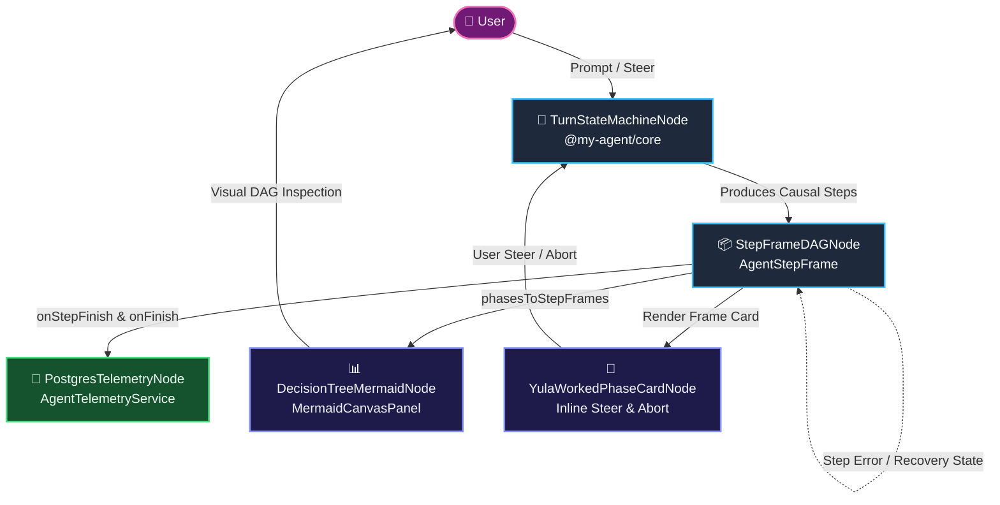

# Causal ReAct Step Frame Architecture & Turn State Machine

This document details the **Causal ReAct Step Frame Architecture**, PostgreSQL telemetry persistence, and the live Mermaid Decision Tree DAG in the Yula AI runtime.

> Canonical Master Graph Index: [`src/yula-ai/agent.md`](file:///Users/tmr/Source/ArrowApi/src/yula-ai/agent.md)  
> Mandatory Standard: [Graph-Native Documentation Standard](file:///Users/tmr/Source/ArrowApi/.agents/standards/graph-documentation-standard.md)

---

## 1. System Graph Diagram (Mermaid)

---

## 2. Nodes Catalog

### 2.1 TurnStateMachineNode (`@my-agent/core`)
- **Role:** Coordinates the lifecycle of a conversational turn across deterministic states: `idle`, `planning`, `executing_tools`, `evaluating`, `waiting_for_user`, `completed`, and `failed`.
- **Contracts:**
  - Inbound: User prompt, inline steering messages, tool execution outcomes.
  - Outbound: Emits `state_transition`, `step_frame_start`, `step_frame_end` events.

### 2.2 StepFrameDAGNode (`AgentStepFrame`)
- **Role:** Encapsulates each atomic agent action as an immutable, causally-chained step frame.
- **Data Contract:**
  - `id`: Unique step identifier (`string`).
  - `parentStepId`: Preceding step identifier establishing the directed acyclic causal chain (`string | null`).
  - `turnState`: The current `AgentTurnStateStatus`.
  - `phase`: Semantic phase category (`planning`, `exploration`, `execution`, `confirmation`, `recovery`).
  - `thought`: Internal reasoning before tool execution.
  - `toolName`, `input`, `output`, `errorMessage`: Structured parameters and results.
  - `transitionReason`: Explicit justification for why step $N+1$ followed step $N$.
  - `isRecovery`: Boolean flag indicating whether the step was initiated to repair a preceding error.

### 2.3 PostgresTelemetryNode (`AgentTelemetryService`)
- **Role:** Asynchronously commits step frames and turn aggregates into PostgreSQL tables (`agent_runs` and `agent_steps`).
- **Contracts:**
  - Inbound: Step frames from `onStepFinish` and token aggregates from `onFinish` in `/api/agent/chat/route.ts`.
  - Outbound: Reconstructs causal run DAGs for diagnostic post-mortems.

### 2.4 DecisionTreeMermaidNode (`decision-tree-mermaid.ts`)
- **Role:** Transforms an array of `AgentStepFrame` items into an interactive Mermaid `flowchart TD` diagram with color-coded nodes (success: green, error: red, recovery: purple, running: orange).
- **Contracts:**
  - Inbound: `phasesToStepFrames(phases, conversationId)`.
  - Outbound: Dispatches to `useActiveDiagramStore` to open in `MermaidCanvasPanel`.

### 2.5 YulaWorkedPhaseCardNode (`YulaWorkedPhaseCard`)
- **Role:** High-transparency UI card rendering thought rationale, formatted JSON tool inputs/outputs, error banners, and inline HITL controls (Live Steer and Abort).
- **Contracts:**
  - Inbound: `WorkedStepPhase` derived from `extractWorkedSteps`.
  - Outbound: Invokes `chat.steer(text)` or `chat.stop()` directly on active stream.

---

## 3. Edges & Flow Dynamics

1. **Step-to-Step Causal Transition:** When Step $N$ finishes (e.g. `grid_run_sql` returns `"Table not found"`), the causal transition sets `parentStepId = Step_N.id` and flags Step $N+1$ with `isRecovery = true` and `transitionReason = "Recovering from error in grid_run_sql"`.
2. **Inline Steer Safety Loop:** While `phase.isLive` is active, the user can type a steering directive via `YulaWorkedPhaseCard`. This dispatches directly into the active LLM context without terminating the turn.
3. **Mermaid DAG Inspection:** Clicking "Karar Ağacı" in `YulaWorkedAccordion` invokes `openDecisionTreeDiagram`, presenting the user with an architectural Directed Acyclic Graph of the entire turn.

---

## 4. Traversable Graph Neighbors

- Upstream: [Headless React Agent](file:///Users/tmr/Source/ArrowApi/.agents/architecture/headless-react-agent.md)
- Standard: [Graph Documentation Standard](file:///Users/tmr/Source/ArrowApi/.agents/standards/graph-documentation-standard.md)
- History: [Architecture Decision Log](file:///Users/tmr/Source/ArrowApi/.agents/log.md)
