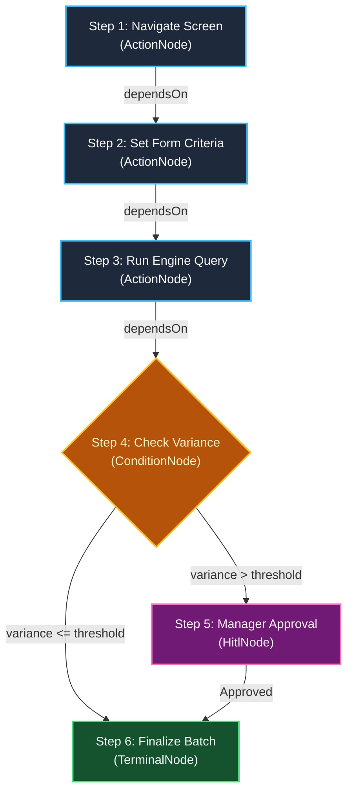
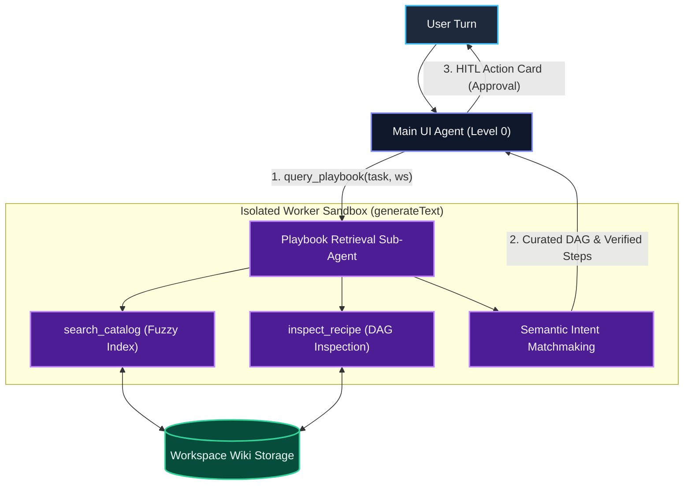

# Procedural Memory & LLM Playbook Architecture

This document explains the procedural memory system inspired by Karpathy's "LLM Wiki / Playbook" pattern, its multi-tiered hierarchy, and its integration with `@my-agent`.

---

## 1. Why Procedural Memory?

Semantic memory (vector search/RAG) stores user preferences ("User prefers dark mode"), whereas **procedural memory (playbook)** records actionable execution steps ("When running the stock variance report, always select warehouse 01 and sort descending by variance in the result grid").

Procedural memory prevents repetitive trial-and-error reasoning, guiding the agent to follow verified workflows immediately.

---

## 2. Multi-Tiered Wiki Architecture (System $\rightarrow$ Workspace $\rightarrow$ User)

Operational rules are stored and merged across a 3-tier hierarchy:

1. **System Tier (`storage/wiki/system/`):** Baseline operating procedures and platform defaults.
2. **Workspace Tier (`storage/wiki/<workspace>/`):** Domain-specific guidelines (stock, sales, accounting).
3. **User Tier (`storage/wiki/users/<userId>/`):** User customizations and explicit corrections.

> [!TIP]
> **Precedence Order:**
> `User Rule` $>$ `Workspace Rule` $>$ `System Rule`. More specific scopes override higher-level defaults.

---

## 3. Library vs. Application Layer Separation

The playbook architecture is decoupled cleanly:
- **Library Layer (`@my-agent/core` & `@my-agent/react`):**
  - `AgentPlaybookStorage` contract: Storage-agnostic abstraction.
  - `RestPlaybookStorage` (server API) and `LocalStoragePlaybookStorage` (browser storage).
  - `AgentProvider` Dependency Injection: Easily overridden via the `playbookStorage` prop in any React app.
  - `useAgentPlaybook` hook: Enables components to read and propose rule updates.
- **Application Layer (`yula.client`):**
  - `PlaybooksManagementView.tsx`: User interface for reviewing and managing operational playbooks.
  - `/api/agent/playbook/*`: Next.js endpoints persisting Markdown files to server storage.

---

## 4. Transparent Worked Steps

As the agent runs, playbook access and updates are rendered transparently in `yula-worked-steps.tsx`:
- **Read Step:** `📖 Read 2 rules from Workspace Wiki (stock)`
- **Update Step:** `📝 Proposed Wiki Rule Update (stock:balance)`

---

## 5. Graph-Native Workflow Recipes (DAG Architecture)

While single-screen guidelines (`screen_rule`) remain flat Markdown items, multi-step execution plans (`workflow_recipe`) are modeled as **Directed Acyclic Graphs (DAGs)** to ensure zero-hallucination deterministic ReAct execution and live observability.

### 5.1. Engine & Canvas Architecture
- **Pure Core Engine (`@my-agent/core`):**
  - [`PlaybookDAG`](file:///Users/tmr/Source/ArrowApi/src/yula-ai/packages/agent-core/src/playbook-graph.ts): Zero-dependency typed DAG container implementing Tarjan DFS cycle detection, Kahn's topological sorting, predecessor/successor lookups, and Markdown step serialization.
  - Mathematical Linting: `PlaybookService.lint()` detects circular dependencies and orphaned workflow steps during static validation.
- **Client Canvas (`yula.client`):**
  - [`WorkflowGraphCanvas.tsx`](file:///Users/tmr/Source/ArrowApi/src/Sims/yula.client/src/workspaces/my/components/playbooks/workflow-graph-canvas.tsx): Interactive React Flow (`@xyflow/react`) canvas styled with Shadcn UI cards.
  - Auto-Layout Engine: `@dagrejs/dagre` calculates hierarchical layout coordinates dynamically in-browser, keeping disk Markdown files clean, human-readable, and git-diff friendly without hardcoding pixel coordinates.
  - Dual Mode View: [`PlaybooksManagementView.tsx`](file:///Users/tmr/Source/ArrowApi/src/Sims/yula.client/src/workspaces/my/components/playbooks/playbooks-management-view.tsx) supports instant switching between the list Card View and the interactive Graph (DAG) View.

---

## 6. Two-Tier Retrieval & Tool-as-a-Subagent Pattern

To prevent **Context Window Bloat** as corporate recipe catalogs scale to hundreds of entries, the system uses a **Two-Tier Retrieval Architecture** based on the Vercel AI SDK "Tool-as-a-Subagent" (Nested Worker) pattern:

### Key Architectural Benefits:
1. **Zero Context Bloat:** Only active screen rules (1–3 lines) reside in Level-0 prompt. Workflow recipes are decoupled from the system prompt, saving 30k–100k tokens per request.
2. **Semantic Intent Resolution:** Natural language business requests (e.g., *"ay sonu depo sayımını eşitle"*) are mapped to verified corporate recipe IDs (`recipe-stock-reconciliation`) via isolated subagent reasoning rather than brittle keyword overlap.
3. **Resilient Pi Fallback:** If the subagent fails or times out (3500 ms limit), execution seamlessly drops into local deterministic index search without UI disruption.

