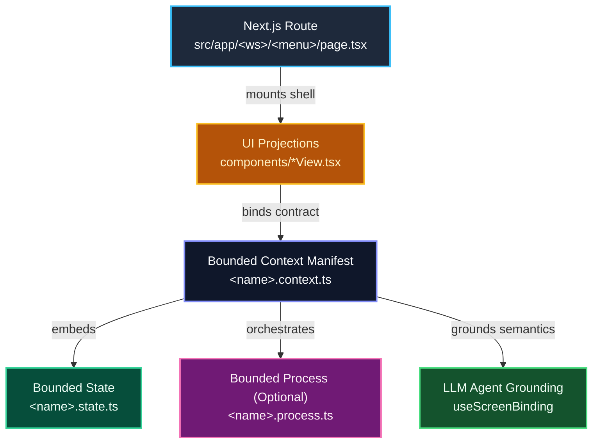

# Bounded Context & Menu Architecture Standard

This standard formalizes the domain-driven architecture for workspace menu items in Yula Client (`src/Sims/yula.client/src/workspaces/`), establishing the **1 Menu Item = 1 Bounded Context** principle and ensuring zero disruption to Next.js App routing (`src/app/`) and platform engines (`src/features/`).

---

## 1. Architectural Topology (Directed Graph)



---

## 2. The Core Formula

$$\mathbf{Bounded\ Context = Bounded\ Process + Bounded\ State}$$

Every menu item in an enterprise workspace represents a self-contained Bounded Context:
- **Bounded State (`*.state.ts`):** Domain entities, field definitions, aliases, enum values, and validation constraints. For transactional documents, formalized as an **Aggregate Root** (`aggregate-root.ts`):
  - **Root Entity (Header):** Top-level document gateway (`order_no`, `customer_id`, `grand_total`, `status`).
  - **Child Entities (Lines / Collections):** Detail collections (`items: SalesOrderItem[]`, `taxes: TaxLine[]`) with `minCount` / `maxCount` constraints.
  - **Invariants:** Cross-entity consistency guards (e.g. `grand_total === sum(items.amount)`).
- **Bounded Process (`*.process.ts`):** Finite state machine (e.g. `Draft -> Dispatched -> Invoiced`), allowed transitions, and step preconditions. *Omitted for static master data or read-only analytical reports.*
- **Context Manifest (`*.context.ts`):** Context identity, title, route, workspace binding, and `ScreenContract` integration.
- **UI Projections (`components/*`):** One or more views (Grids, Forms, Drawers) rendering the state and triggering process transitions.


---

## 3. Dot-Suffix Naming Convention

Within each `src/workspaces/<workspace>/<menu-item>/` directory:

| File Pattern | Role | Description |
| :--- | :--- | :--- |
| **`[name].context.ts`** | **Context Manifest** | Defines the Bounded Context metadata, category, and `ScreenContract`. |
| **`[name].state.ts`** | **Bounded State** | Business ontology, field descriptions, aliases, and validation rules. |
| **`[name].process.ts`** | **Bounded Process** | State machine transitions and lifecycle rules (omitted if stateless). |
| **`components/*View.tsx`** | **UI Projections** | Screen components (e.g. `ItemFormShell.tsx`, `DeliveryNoteListView.tsx`). |
| **`index.ts`** | **Public API Entrypoint** | Single-door export surface (`AGENTS.md` Rule 3). |

---

## 4. Bounded Context Categories

### A. Master Data Context (Süreçsiz / Stateless)
- **Examples:** `stock/item` (Malzeme Kartı), `crm/party` (Firma/Cari Kartı).
- **Process:** None (`*.process.ts` is omitted).
- **Agent Focus:** Attribute validation, categorization, field lookups.

### B. Transactional Context (Süreçli / Stateful Lifecycle)
- **Examples:** `stock/delivery-note` (İrsaliye), `procurement/purchase-order` (Satın Alma Siparişi).
- **Process:** State machine with deterministic transition guards.
- **Agent Focus:** Step execution, validation of preconditions before state change.

### C. Analytical Context (Rapor / CQRS Read Model)
- **Examples:** `stock/stock-balance` (Stok Bakiye Raporu), `stock/stock-ledger`.
- **Process:** None. State represents filter criteria and SQL projection parameters.
- **Agent Focus:** DuckDB WASM queries, criteria generation, visualization.

---

## 5. Architectural Boundaries & Non-Negotiables

1. **`src/app/` Immutability:** Next.js route files (`page.tsx`) MUST remain thin wrappers. They must never contain business logic, state machines, or direct queries.
2. **`src/features/` Platform Engines:** Cross-cutting platform modules (`reports`, `jobs`, `auth`, `skills`) are infrastructure providers, not Bounded Contexts.
3. **Public API Isolation:** Files outside a workspace must only import from `@/workspaces/<workspace>`.

---

## 6. Internationalization & Localization (`next-intl`)

Per `frontend-rules.md` Rule 4, all user-facing and agent-facing text must support localization:
- **`i18nNamespace`**: Standardized as `BoundedContext.<EntityName>` (e.g. `BoundedContext.StockItem`).
- **Dynamic Prompt Localization**: `formatBoundedContextPrompt(context, t)` dynamically formats the LLM system prompt in the user's active session locale (`tr` vs. `en`).
- **Single Source of Truth**: UI form labels and LLM attribute aliases match 1:1 via `src/messages/*.json`.
- **Localized Guardrails**: Process transition failures (`validateTransition`) return localized feedback in the active language.

---

## 7. Multi-Jurisdiction Strategy Pattern

To handle operations across multiple countries (e.g. Turkey vs. Germany) without polluting menus or branching routes:

$$\mathbf{Effective\ Context = Base\ Context \oplus Country\ Strategy(countryCode)}$$

1. **No Country Menus**: We NEVER create separate menu items or routes for jurisdictions (e.g., no `/stock/delivery-note-tr` or `/stock/delivery-note-de`). There is exactly ONE universal menu item (`/stock/delivery-note`).
2. **Session-Driven Resolution**: When the user opens a screen, `useScreenBinding` retrieves the active company's jurisdiction (`countryCode`) from the user session and invokes `resolveContextStrategy(baseContext, countryCode)`.
3. **Strategy Directory Structure**:
   ```
   src/workspaces/<ws>/<menu>/
     strategies/
       [name].tr.ts    # Turkey strategy (e.g. GTİP, Tevkifat, ÖTV, GİB E-İrsaliye)
       [name].de.ts    # Germany strategy (e.g. Zolltarifnummer, MwSt, GoBD, XRechnung)
   ```
4. **Augmentations**: Strategies can augment:
   - `stateAugmentation`: country-specific fields, validations, and aliases.
   - `processAugmentation`: additional transitions (e.g. `GibSigning`), regulatory transition guards, and audit rules.

---

## 8. Cross-Company Segregated Batch Operations

When a user manages multiple legal entities in a holding or group company (e.g., managing 5 companies across Turkey and Germany):

1. **Strict Tenant Segregation**: A single batch prompt (e.g. *"Approve all pending orders across all my companies"*) MUST NEVER execute as an unsegregated monolithic job.
2. **Isolated Execution per Strategy**:
   - `executeSegregatedBatch()` groups entities by tenant/company.
   - Each company executes its action using its own resolved `JurisdictionStrategy` (e.g. TR companies run GİB compliance checks; DE companies run GoBD audit checks).
3. **Segregated Summary Output**:
   - The LLM agent receives and reports segregated results partitioned by company (`formatSegregatedBatchReport`):
   - Example:
     - `Company A (TR)`: 12 approved, 1 failed (E-İrsaliye schema error).
     - `Company B (DE)`: 5 approved, 0 failed.
   - Failures in one company never contaminate or block valid transactions in another.

---

## 9. 6-Step Implementation Checklist

When scaffolding or refactoring a menu item into a Bounded Context:

1. **State (`*.state.ts`)**: Define schema, entity fields, aliases, and validation rules.
2. **Process (`*.process.ts`)**: If transactional, define initial state, allowed transitions, and guard criteria.
3. **Strategies (`strategies/*.ts`)**: If jurisdiction-sensitive, implement `JurisdictionStrategy<TState>` per country.
4. **Context Manifest (`*.context.ts`)**: Assemble `BoundedContextContract`, register strategies, and link `ScreenContract`.
5. **Localization (`messages/{tr,en}.json`)**: Add matching keys under `BoundedContext.<Name>`.
6. **Agent Hook (`use-<name>-agent.ts`)**: Bind screen via `useScreenBinding(context.screen, { t, countryCode })`.

---

## 10. Cross-Context Coordination: Saga Orchestrators

While Bounded Processes (`*.process.ts`) govern state machines strictly *within* a single Bounded Context, multi-step value streams that coordinate *across* multiple Bounded Contexts (e.g. `Sales Order -> Delivery Note -> Sales Invoice`) are managed by **Workspace & Cross-Workspace Saga Orchestrators**.

See the comprehensive companion standard:  
👉 [Workspace Orchestration & Saga Architecture Standard](file:///Users/tmr/Source/ArrowApi/.agents/standards/workspace-orchestration-saga-standard.md)

---

## 11. Canonical Bounded Context Catalog

| Workspace | Bounded Context ID | Type | Aggregate / Model | Process / Transitions | Jurisdiction Strategies |
| :--- | :--- | :--- | :--- | :--- | :--- |
| **`stock`** | `stock_item` | `masterdata` | `StockItemState` | N/A (Master Data) | `TR` (GTİP/ÖTV), `DE` (Zolltarif) |
| **`stock`** | `delivery_note` | `transactional` | `DeliveryNoteAggregate` | `Draft ➔ Dispatched ➔ Invoiced` | `TR` (GİB E-İrsaliye), `DE` (Lieferschein) |
| **`stock`** | `stock_balance` | `analytical` | `StockBalanceFilterState` | N/A (CQRS Read Model) | Universal DuckDB |
| **`stock`** | `stock_ledger` | `analytical` | `StockLedgerFilterState` | N/A (CQRS Read Model) | Universal DuckDB |
| **`stock`** | `stock_analytics` | `analytical` | `StockAnalyticsFilterState`| N/A (CQRS Read Model) | Universal DuckDB |
| **`stock`** | `retail_sales_report`| `analytical` | `RetailSalesFilterState` | N/A (CQRS Read Model) | Universal DuckDB |
| **`selling`** | `sales_order` | `transactional` | `SalesOrderAggregate` | `Draft ➔ Pending ➔ Approved ➔ Dispatched` | `TR` (E-Fatura Senaryo), `DE` (USt-IdNr/§13b) |
| **`selling`** | `sales_invoice` | `transactional` | `SalesInvoiceAggregate` | `Draft ➔ Signed ➔ Posted ➔ Paid` | `TR` (GİB ETTN/Tevkifat), `DE` (XRechnung/GoBD) |
| **`accounting`**| `general_ledger` | `analytical` | `GeneralLedgerFilterState`| N/A (CQRS Read Model) | Universal DuckDB |
| **`accounting`**| `customer_ledger`| `analytical` | `CustomerLedgerFilterState`| N/A (CQRS Read Model) | Universal DuckDB |
| **`accounting`**| `supplier_ledger`| `analytical` | `SupplierLedgerFilterState`| N/A (CQRS Read Model) | Universal DuckDB |


