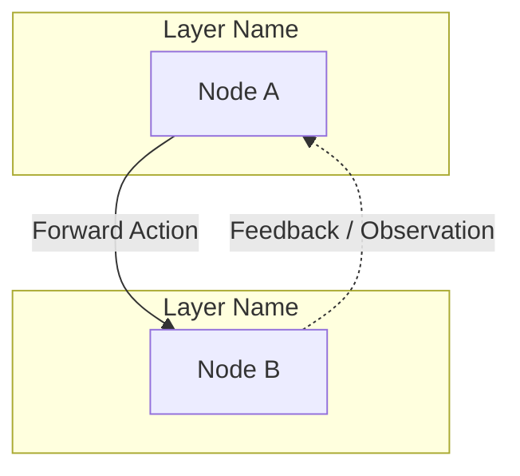

# Graph-Native (Node & Edge) Documentation Standard

This standard defines the **mandatory specification** for documenting AI agents, tools, components, and workflows across the ArrowApi and Yula AI repository.

---

## ⚡ Core Principles & Mandates

1. **Graph Paradigm:** Every system, subsystem, or multi-agent workflow MUST be modeled as a **Directed Graph (Digraph)**.
   - **Nodes:** Every Agent, Tool, Service, Component, or Human Actor is a discrete Node.
   - **Edges:** Every interaction, tool dispatch, event stream, API call, and feedback loop is a directed Edge.
2. **Mandatory 3-Section Structure:** Every architecture or agent workflow document MUST contain:
   - `## 1. System Graph Diagram (Mermaid)`
   - `## 2. Nodes Catalog`
   - `## 3. Edges & Flow Dynamics`
3. **Traversable Neighbor Links:** Every Node definition MUST include reciprocal markdown links to its upstream (inbound) and downstream (outbound) neighbors.
4. **Explicit Feedback & Safety Loops:** All error branches, HITL pauses, self-healing retries, and circuit breakers (e.g. stagnation halt) must be explicitly listed as edges.
5. **500-Line Limit:** No single documentation file may exceed 500 lines (`wc -l`). Use modular sub-documents linked via neighbor links for deep technical specs.
6. **English-Only Mandate:** All documentation must be written strictly in technical English.

---

## 📋 Required Document Structure Template

When creating or updating an architecture or agent documentation file, use the following template:

```markdown
# [System / Subsystem Name] Graph Architecture

Brief overview explaining the scope and purpose of this graph.

---

## 1. System Graph Diagram (Mermaid)



---

## 2. Nodes Catalog

For each Node:

### 🏷️ `NodeName` (Node Type: Orchestrator / Tool / UI Component / Backend Engine)
- **Scope / ID:** Unique registration ID or route (e.g. `criteria_form:<scope>`, `job_history`).
- **Role:** Specific responsibility and operational invariant.
- **Contracts / Schemas:** Input payload type and output response shape (Zod schema or TypeScript interface).
- **Inbound Edges (Upstream Neighbors):**
  - Triggered by `[UpstreamNode](link-to-node-or-doc)` via `<Event / Action Name>`.
- **Outbound Edges (Downstream Neighbors):**
  - Dispatches to `[DownstreamNode](link-to-node-or-doc)` with `<Payload Type>`.
- **Feedback & Fallback Loops:**
  - *On Error:* What error payload is emitted, and which node receives it for self-healing?
  - *On HITL Pause:* How is the execution paused, and what action resumes it?
  - *Circuit Breaker:* Conditions under which execution terminates to prevent stagnation or runaway loops.

---

## 3. Edges & Flow Dynamics

Step-by-step narration of primary and alternative execution pathways:
- Standard Happy Path (Initiation $\rightarrow$ Execution $\rightarrow$ Observation $\rightarrow$ Completion).
- Self-Healing / Error Correction Loop.
- Human-in-the-Loop (HITL) Pause & Resume Flow.
```

---

## 🔗 Traversable Linking Rule

To allow both AI agents and human engineers to navigate the architecture seamlessly:
- When Node A connects to Node B, Node A's document MUST include a clickable relative markdown link to Node B (`[NodeB](./path-to-doc.md#nodeb)`).
- Cross-document links must use standard markdown links with relative paths or anchor tags.
- Broken links or ungrounded node names without explicit definitions are strictly prohibited.
