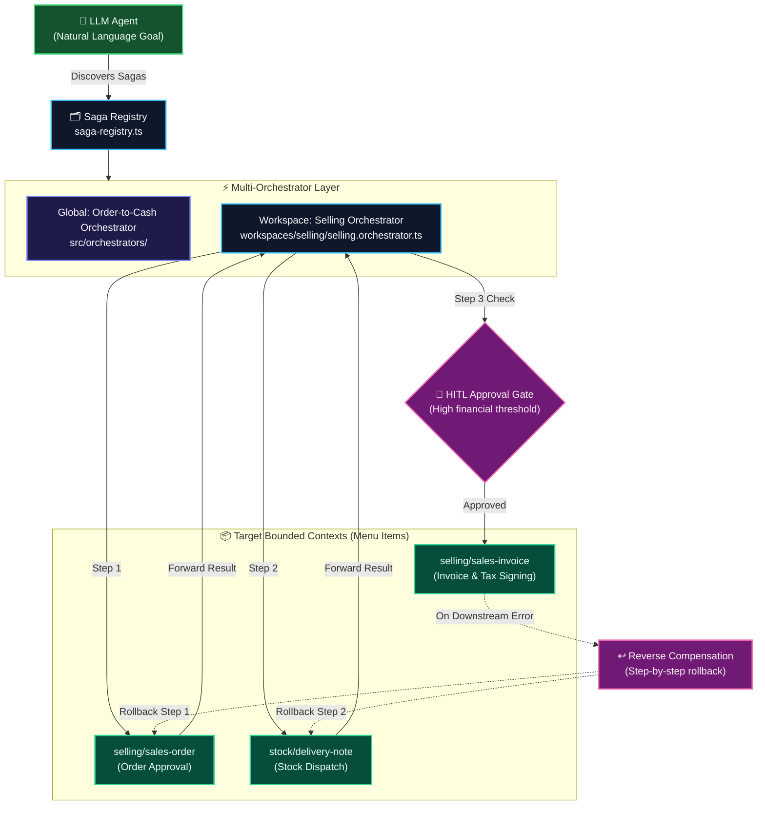

# Workspace Orchestration & Saga Architecture Standard

This standard formalizes the **Multi-Orchestrator and Distributed Saga Architecture** across Yula Client workspaces (`src/Sims/yula.client/src/workspaces/` and `src/orchestrators/`), enabling deterministic coordination of multi-step business value streams across multiple Bounded Contexts.

> Companion Standard: [Bounded Context & Menu Architecture Standard](file:///Users/tmr/Source/ArrowApi/.agents/standards/bounded-context-menu-standard.md)  
> Mandatory Standard: [Graph-Native Documentation Standard](file:///Users/tmr/Source/ArrowApi/.agents/standards/graph-documentation-standard.md)

---

## 1. Architectural Topology (Directed Graph)

---

## 2. The Core Formula

$$\mathbf{Workspace\ Orchestrator = Composite\ Workflow\ [BC_1 \rightarrow BC_2 \rightarrow \dots \rightarrow BC_n]}$$

While each menu item maintains strict isolation as an independent **Bounded Context** ($BC = Bounded\ State + Bounded\ Process$), real enterprise value streams span multiple Bounded Contexts (e.g. *Order-to-Cash*: Sales Order $\rightarrow$ Delivery Note $\rightarrow$ Sales Invoice).

### Bounded Process vs. Saga Orchestrator

| Dimension | Bounded Process (`*.process.ts`) | Saga Orchestrator (`*.orchestrator.ts`) |
| :--- | :--- | :--- |
| **Scope** | **Intra-Context (Single Screen / Entity)** | **Inter-Context (Cross-Screen / Value Stream)** |
| **Responsibility** | Local entity state machine (`Draft -> Approved`) | Multi-entity sequential coordination |
| **Awareness** | Zero knowledge of other menus/screens | Coordinates steps across multiple Bounded Contexts |
| **Rollback** | State transition validation errors | Distributed compensating actions across prior steps |
| **HITL** | Local form validation | Workflow-level user confirmation gates |

---

## 3. Multi-Orchestrator Segregation (Zero God Orchestrators)

To preserve modularity and adhere strictly to `AGENTS.md` Rule 2 (500-line limit), orchestrators are segregated across two distinct layers:

### Layer A: Workspace-Level Orchestrators (`src/workspaces/<ws>/<ws>.orchestrator.ts`)
Domain-specific sagas operating within a single workspace:
- `selling.orchestrator.ts`:
  - `selling:domestic-order-to-invoice`: Standard domestic pipeline.
  - `selling:export-order`: Export clearance and customs declaration pipeline.
  - `selling:sales-return`: Customer return, quality inspection, and credit note pipeline.

### Layer B: Cross-Workspace (Enterprise) Orchestrators (`src/orchestrators/`)
Cross-cutting value streams coordinating multiple business departments:
- `order-to-cash.orchestrator.ts`: Coordinates `selling` (Order) $\rightarrow$ `stock` (Dispatch) $\rightarrow$ `accounting` (General Ledger & AR).
- `procure-to-pay.orchestrator.ts`: Coordinates `procurement` (PO) $\rightarrow$ `stock` (Receipt) $\rightarrow$ `accounting` (AP Invoice).

---

## 4. Saga Lifecycle & Execution Semantics

Every saga executes through `executeSaga(saga, initialPayload)` in `workflow-orchestrator.ts`:

1. **Sequential Step Forwarding:**
   - Step $i$ output is fed to Step $i+1$ via `payloadTransform(prevResult, accumulatedState, ctx)`.
2. **Reverse Compensating Rollback:**
   - If Step $N$ encounters an unhandled exception or rejected validation, the engine halts forward execution and sets status to `compensating`.
   - The engine iterates through completed steps in **reverse order** ($N-1, N-2, \dots, 1$), invoking each step's `compensate()` handler to restore systemic integrity.
3. **Inline Human-in-the-Loop (HITL) Gateways:**
   - Any step can define `hitlCheck(stepOutput, accumulatedState, ctx)`.
   - If `requiresHitl: true`, the engine suspends execution with status `hitl_waiting`, captures a serializable `suspensionContext`, and alerts the user/agent.
   - Resumption is achieved deterministically via `resumeSaga(saga, suspensionContext, { approved: true | false })`.
   - Rejection automatically triggers reverse compensation of preceding steps.

---

## 5. Saga Strategy Pattern & Dynamic Step Injection

Sagas support dynamic jurisdiction and business-channel strategies without duplicating base pipelines:

$$\mathbf{Effective\ Saga = Base\ Saga \oplus Country\ Strategy(countryCode,\ channel)}$$

1. **Dynamic Step Injection (`additionalSteps`):**
   - A country strategy can dynamically inject steps via `insertAfter` or `insertBefore` (e.g., TR strategy injects `gib-sign-delivery-note` immediately after `create-delivery-note`; DE strategy injects `vies-vat-validation` immediately before `create-and-sign-invoice`).
2. **Strategy-Specific State Augmentation:**
   - Strategies declare country-specific state fields (e.g. TR: `gibUuid`, `tevkifatOrani`; DE: `viesToken`, `gobdAuditHash`).
3. **Session Resolution:**
   - When `executeSaga(saga, payload, { countryCode })` is invoked, `resolveSagaStrategy()` dynamically merges the pipeline and grounds the LLM agent via `formatSagaPrompt(saga, t, countryCode)`.

---

## 6. Three-Tier Saga State Architecture

Every saga instance maintains state across three distinct operational tiers:

1. **Engine Lifecycle State:** Deterministic state machine tracking execution phase (`pending` $\rightarrow$ `in_progress` $\rightarrow$ `hitl_waiting` $\rightarrow$ `compensating` $\rightarrow$ `completed` / `compensated`).
2. **Accumulated Domain State (`state`):** Forward state accumulator carrying outputs from Step $1 \dots i$ as inputs for Step $i+1 \dots N$.
3. **Compensating Rollback State:** State snapshot required by reverse `compensate()` hooks to undo actions (e.g., invoice ID and GİB UUID needed to void documents).

---

## 7. Multi-Orchestrator Registry (`saga-registry.ts`)

Centralized registry allowing both UI components and LLM agents to discover available workflows:

- `registerOrchestrator(orchestrator)`
- `listOrchestrators({ workspace?: string })`
- `getSaga(sagaId)`
- `listSagas({ workspace?: string })`
- `formatAllSagasPrompt({ workspace?: string }, t?)`

---

## 8. Implementation Checklist for New Sagas

1. **Step Definition:** Define each step with unique `id`, target `contextId`, and target `action`.
2. **Compensation Handlers:** For any step mutating persistent state, implement a reverse `compensate` handler.
3. **HITL Predicates:** Implement `hitlCheck` for operations with high financial value or irreversible consequences.
4. **Strategies (`strategies`):** Implement `SagaStrategy` for jurisdiction-specific steps (e.g. TR vs. DE) or channel deviations (B2B vs. B2C).
5. **Registration:** Register the orchestrator in `saga-registry.ts` via `registerOrchestrator(orchestrator)`.
6. **Prompt Grounding:** Verify `formatSagaPrompt` generates readable markdown for LLM comprehension with active jurisdiction strategy.

