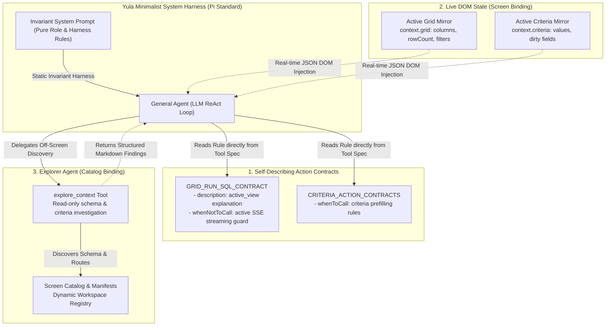

# Yula Minimalist System Harness Standard (Pi Standard)

This document formalizes the **Zero-Prompt-Maintenance Rule** and the **Pi Minimalist System Harness** for Yula AI and ArrowApi. 

> [!IMPORTANT]
> **ENFORCED ARCHITECTURAL INVARIANT:** Adding, modifying, or removing reports, screens, or ERP business modules must **NEVER** require edits to the agent system prompt (`yula-agent-prompt.ts`) — neither as manual prompt text nor as programmatic code/registry imports (e.g. importing `REGISTERED_REPORTS`, dumping `REPORTS_DIGEST_LINES`, or injecting static schema builders into prompt generators). Static prompt grounding, manual criteria dumps, and hardcoded business rules inside prompts are strictly forbidden.

---

## 1. System Graph Diagram (Mermaid)



---

## 2. The 3 Architectural Pillars

```
             ┌────────────────────────────────────────────────────────┐
             │       Yula Minimalist System Harness (Pi Standard)     │
             └──────────────────────────┬─────────────────────────────┘
                                        │
           ┌────────────────────────────┼──────────────────────────┐
           ▼                            ▼                          ▼
┌───────────────────────┐    ┌─────────────────────┐    ┌─────────────────────┐
│ 1. Self-Describing    │    │ 2. Live DOM State   │    │ 3. Explorer Agent   │
│    Action Contracts   │    │    (Screen Binding) │    │    (explore_context)│
├───────────────────────┤    ├─────────────────────┤    ├─────────────────────┤
│ Kurallar kontratta:   │    │ JSON DOM State:     │    │ Ekran dışındayken:  │
│ - "SSE akarken SQL    │    │ Model tablo kolon,  │    │ Salt-okunur olarak  │
│   çalıştırma" kuralı  │    │ satır sayısı ve     │    │ ekran şemasını ve   │
│   RUN_SQL kontratında.│    │ filtrelerini saf    │    │ kriterleri dinamik  │
│ - "active_view nedir" │    │ JSON olarak okur.   │    │ keşfeder.           │
│   kontrat tanımında.  │    │                     │    │                     │
└───────────────────────┘    └─────────────────────┘    └─────────────────────┘
```

### Pillar 1: Self-Describing Action Contracts
Operational invariants, calling preconditions, and domain constraints live strictly inside the tool's contract declaration, never in the general prompt:
- **`description`**: Explains exactly what the action does and what environment entities it targets (e.g. `GRID_RUN_SQL_CONTRACT` explains that queries run against DuckDB's in-memory `active_view` table).
- **`whenNotToCall`**: Prohibits invalid action executions (e.g. forbidding SQL execution while an Arrow Job is currently running or SSE is streaming chunks).
- **`parameters`**: Strongly typed schemas with detailed field descriptions so the LLM constructs valid payloads without prior instruction.

### Pillar 2: Live DOM State (Screen Binding)
When a user is actively viewing a screen or interacting with a component:
- The screen component binds its internal state to the agent context via pure JSON state mirrors (`context.grid`, `context.criteria`).
- The LLM receives the live column list, total row count, active filters, and sorting state in pure JSON under `LIVE SCREEN STATE`.
- No intermediate "grounding text" or artificial prompt formatting functions (e.g., `formatGridPromptGrounding`) are used. The LLM natively interprets structured JSON state.

### Pillar 3: Explorer Agent (Screen & Catalog Binding)
When the user's intent references screens, reports, or business criteria outside the active viewport:
- The general agent does NOT search an overloaded prompt containing all company screens or schemas.
- Instead, it invokes the read-only `explore_context` tool, which delegates to the isolated `explorer` subagent.
- The explorer inspects the screen catalog, workspace registries, and criteria schemas dynamically.
- The explorer returns structured, evidence-based facts (`## Screen / Contract Retrieved`, `## Key Criteria & Schema`, `## Recommended Next Step`), allowing the general agent to execute or navigate accurately.

---

## 3. Nodes Catalog

### 🏷️ `SystemPrompt` (Node Type: Orchestrator Invariant)
- **Role:** Pure persona, tool usage discipline, and structural communication guidelines.
- **Invariant:** Must NEVER contain screen names, SQL table schemas, criteria field lists, or domain business rules.

### 🏷️ `ToolContract` (Node Type: Action Specification)
- **Scope / ID:** `client-tools/*` (`GRID_RUN_SQL_CONTRACT`, `CRITERIA_APPLY_CONTRACT`, etc.).
- **Role:** Self-contained execution rules, DuckDB view semantics, and safety preconditions.
- **Inbound Edges:** Read dynamically by `[SystemPrompt](file:///Users/tmr/Source/ArrowApi/src/Sims/yula.client/src/lib/yula-agent-prompt.ts)` via registered tool definitions.

### 🏷️ `LiveDomState_ScreenBinding` (Node Type: Dynamic Context Resolver)
- **Scope / ID:** `grid-state.ts`, `job-state.ts`, `criteria-form.tsx`.
- **Role:** Real-time projection of mounted React DOM component state into clean JSON snapshots.
- **Inbound Edges:** Emitted by UI components on mount/update.
- **Outbound Edges:** Injected into `context.grid`, `context.criteria` on every turn.

### 🏷️ `ScreenCatalogBinding_ExplorerAgent` (Node Type: Dynamic Knowledge Discovery)
- **Scope / ID:** `explore_context` tool -> `explorer-subagent.ts`.
- **Role:** On-demand lookup of off-screen workspace routes, report manifests, DuckDB table schemas, and criteria definitions.
- **Inbound Edges:** Invoked by `[GeneralAgent](file:///Users/tmr/Source/ArrowApi/src/Sims/yula.client/src/lib/yula-chat-instance.tsx)` when user intent requires off-screen schema knowledge.
- **Outbound Edges:** Returns markdown summary findings without mutating UI state.

---

## 4. Edges & Flow Dynamics

1. **User Request Arrival:** LLM inspects `LIVE SCREEN STATE` (JSON DOM State).
2. **Context Presence Check:**
   - *If relevant screen is mounted:* LLM reads columns/filters directly from `context.grid` and checks the contract `whenNotToCall` before triggering action.
   - *If relevant screen is NOT mounted:* LLM invokes `explore_context` to dynamically query catalog binding metadata.
3. **Action Execution:** LLM dispatches action conforming to the self-describing contract specification.

---

## 5. Development Checklist for New Screens & Reports

When creating a new screen or report in Yula:
- [ ] **Do NOT touch `yula-agent-prompt.ts`**.
- [ ] Register the screen and its metadata in the Workspace Screen Catalog (`workspace-registry.ts` / manifest).
- [ ] Bind the screen's active state to agent context via pure JSON state mirroring (`useScreenBinding` / `context`).
- [ ] Define any custom screen actions with clear `description` and `whenNotToCall` invariants in their contracts.
